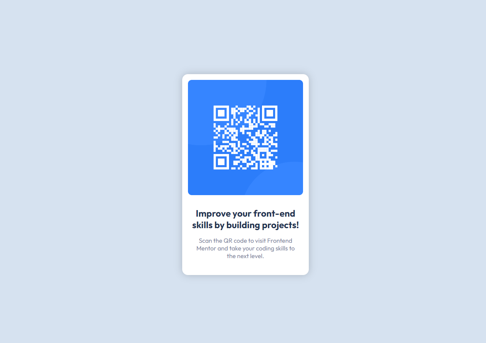

# Frontend Mentor - QR code component solution

This is a solution to the [QR code component challenge on Frontend Mentor](https://www.frontendmentor.io/challenges/qr-code-component-iux_sIO_H). Frontend Mentor challenges help you improve your coding skills by building realistic projects.

## Table of contents

- [Overview](#overview)
  - [Screenshot](#screenshot)
  - [Links](#links)
- [My process](#my-process)
  - [Built with](#built-with)
  - [What I learned](#what-i-learned)
  - [Continued development](#continued-development)
  - [Useful resources](#useful-resources)
- [Author](#author)
- [Acknowledgments](#acknowledgments)

**Note: Delete this note and update the table of contents based on what sections you keep.**

## Overview

### Screenshot



### Links

- Solution URL: [Add solution URL here](https://github.com/Grill3dCheese/FEM-QRCode)
- Live Site URL: [Add live site URL here](https://grill3dcheese.github.io/FEM-QRCode/)

## My process

### Built with

- Semantic HTML5 markup
- CSS custom properties
- Flexbox

### What I learned

One thing I've done in the past when creating is to work on the HTML structure and CSS styling simultaneously. However, Frontend Mentor suggested that I start with the structure first. Once that is completed, then move on to styling. This helped me tremendously to think about what elements I'd need to "get the job done" and from there I was able to focus solely on styling. I'll certainly continue to work this way going forward!

I recently learned about issues the CSS unit, vh, can cause. Especially when it comes to viewing on a mobile device. In this project, I tried a new approach of using the % unit, which worked perfectly! See below on how I did this:

```css
html,
body {
  height: 100%;
}

.container {
  min-height: 100%;
}
```

### Continued development

- Continue using % (percentage) CSS units instead of vh
- Continue using and learning more about Flexbox, Grid, their differences

### Useful resources

- [Example resource 1](https://www.joshwcomeau.com/css/custom-css-reset/#digit-percentage-based-heights) - This helped me better understand how to properly use the % CSS unit. With this I was able to fully center my card element without needing to us the vh unit.

## Author

- Website - [Keith McKenna](https://www.keithmckenna.com)
- Frontend Mentor - [@yourusername](https://www.frontendmentor.io/profile/Grill3dCheese)
- Twitter - [@yourusername](https://www.twitter.com/keithmckenna)

## Acknowledgments

Thank you, TREMENDOUSLY, Josh Comeau, for your amazing article explaining percentage based heights! This was a game changer for me!
